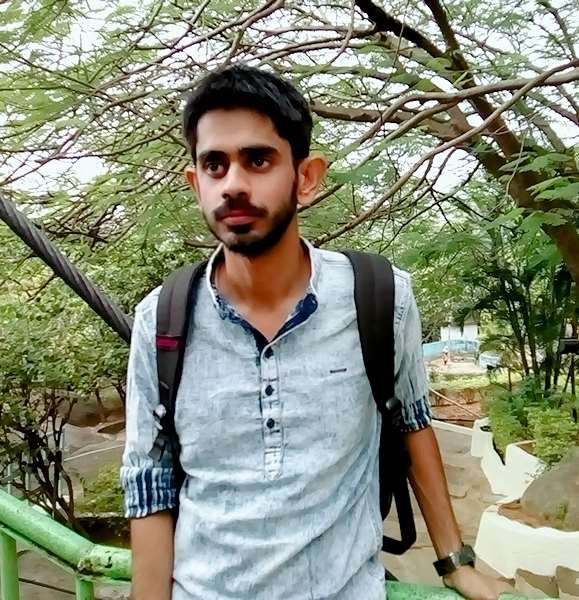

Abhirup presented his research in a rapid talk at PP65 (the 65th birthday celebration of Prof. Prasanta Panigrahi) that was held recently at DPS, IISER Kolkata. He gave a short but insightful overview of his research on the Kondo effect and what causes its breakdown. Congratulations, Abhirup!

{: .body_img}
